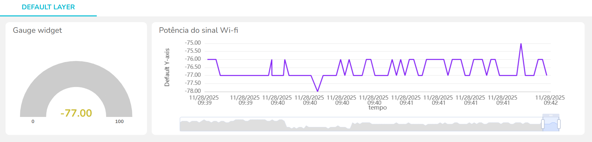

# Medidor de Potencia de Sinal WiFi

Nessa atividade, o intuito foi coletar dados referentes ao sinal do Wifi em dBm e publica-los em um dashboard que, sendo atualizado em tempo real, nós dá informações precisas sobre a potência do sinal. Para isso, o projeto conta com um **microcontrolador ESP32** conectado a um **Wifi**, medindo o sinal de radiofrequência por meio de uma **antena omnidirecional**, imprimindo os dados no monitor serial da **Arduino IDE** além de publicar esses dados num dashboard do **Ubidots**. Abaixi está a imagem dos dois gráficos gerados no Ubidots a partir dos dados coletados.

*Figura 1 – Gráficos de Gauge (dBm atual) e linha(dBm x Tempo)*

Clique [aqui](https://github.com/deborangueira/Medidor-de-Potencia-de-Sinal-WiFi/blob/main/script.ino) para acessar o código, e [aqui](https://drive.google.com/drive/folders/1lBqjFNJQI2lqSDpRS0e9NW9RzOs1zr5t?usp=sharing) para assistir o vídeo que demonstra o comportamento do Wifi pelo campus da faculdade. 
